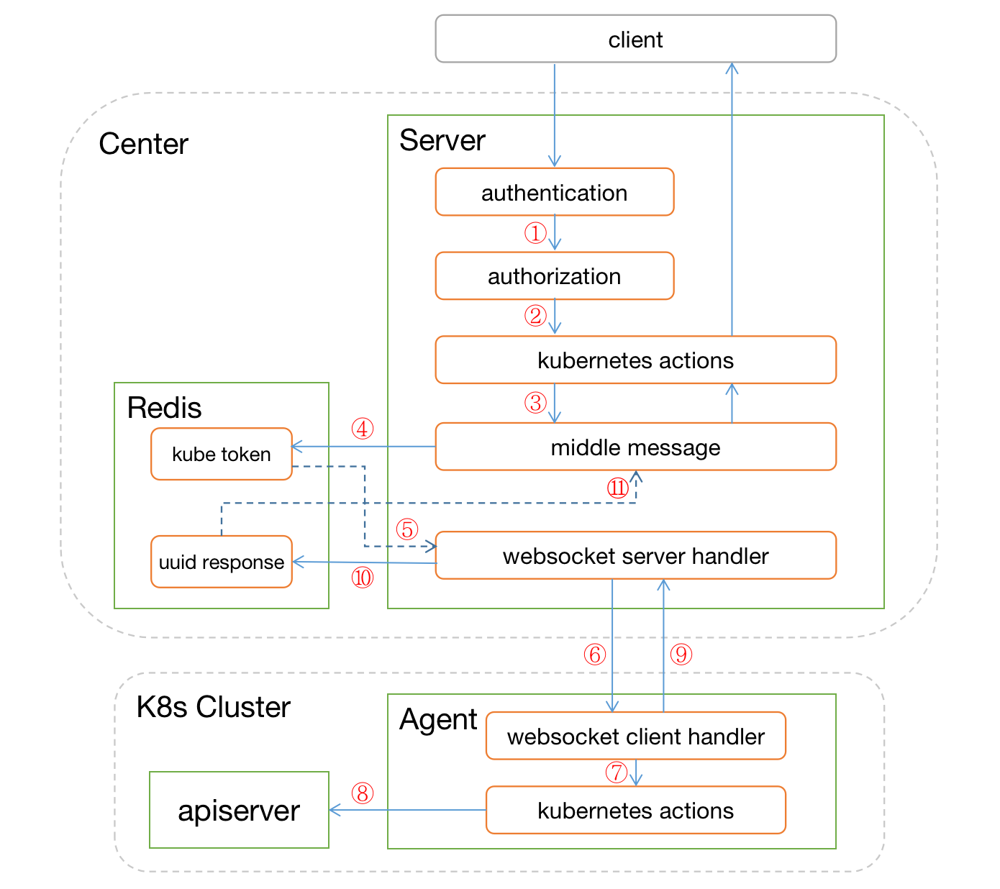

### 一、 整体架构



### 二、 数据库设计

#### 1. 数据库方案

由于在软件设计架构中，采用了redis作为异步消息通知的中间件，所以考虑数据库也使用redis来存储后端数据。而且该系统中的数据结构较简单，数据量也不会很大。这样统一使用一套redis数据库系统，后期也方便管理、维护及迁移数据。

#### 2. 数据库设计

所有的数据结构都会有一个附加osp:<table>:_sets集合，用来存放该数据结构的所有主键。

##### user

存储键

> osp:user:<name>

存储结构

| 字段        | 类型     | 描述           |
| ----------- | -------- | -------------- |
| name        | string   | 用户名称，主键 |
| email       | string   | 用户邮箱       |
| password    | string   | 密码           |
| create_time | datetime | 创建时间       |
| update_time | datetime | 更新时间       |

##### cluster

存储键

> osp:cluster:<name>

存储结构

| 字段        | 类型     | 描述               |
| ----------- | -------- | ------------------ |
| name        | string   | 集群名称，主键     |
| description | string   | 集群描述           |
| token       | string   | agent访问集群token |
| create_time | datetime | 创建时间           |
| update_time | datetime | 更新时间           |

##### role

存储键

> osp:role:<name>

存储结构

| 字段        | 类型     | 描述           |
| ----------- | -------- | -------------- |
| name        | string   | 角色名称，主键 |
| permissions | string   | 权限列表       |
| create_time | datetime | 创建时间       |
| update_time | datetime | 更新时间       |

##### rolebinding

存储键

> osp:rolebinding:<username>

存储结构

| 字段        | 类型         | 描述           |
| ----------- | ------------ | -------------- |
| user        | string       | 用户名称，主键 |
| roles       | list[string] | 角色名称列表   |
| create_time | datetime     | 创建时间       |
| update_time | datetime     | 更新时间       |


```
    global
        daemon
        maxconn 256

    defaults
        mode http
        timeout connect 5000ms
        timeout client 50000ms
        timeout server 50000ms

    frontend http-in
        bind *:80
        default_backend servers

    backend servers
        server server1 127.0.0.1:8000 maxconn 32


    # The same configuration defined with a single listen block. Shorter but
    # less expressive, especially in HTTP mode.
    global
        daemon
        maxconn 256

    defaults
        mode http
        timeout connect 5000ms
        timeout client 50000ms
        timeout server 50000ms

    listen http-in
        bind *:80
        server server1 127.0.0.1:8000 maxconn 32
```

